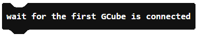
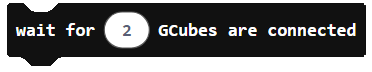
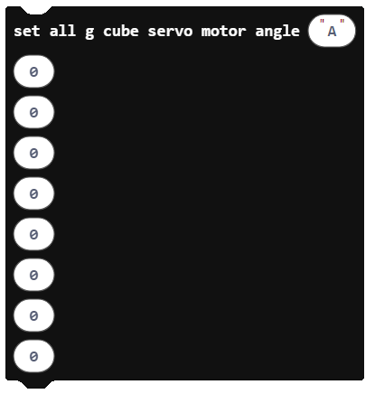
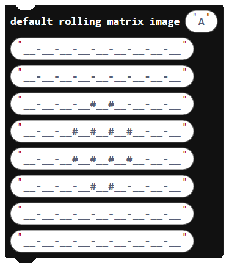
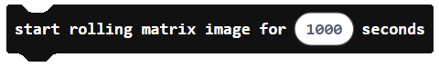

## About GCube

GCube is a cube type module which include stepper motor, battery, sensors and BLE 5.0 cpu based board.
It is available to use dot-matrix, RC servo motor or various sensors with GCube, because GCube has general external sensor port.
With just 1 GCube you are able to make robotics and more and more GCubes you have, you can build any kind of robot.
We've released this extension for Micro:bit users to use GCube for robotics and IoT projects.

More information:
www.roborisen.com   qna@roborisen.com

[Manual] https://drive.google.com/drive/folders/11JqWqxEkSc4-BoQamWtnHFTjx67_udxD

[Activity] https://youtu.be/wTfnsPbgm3s

 
 

## How to connect GCubes to Micro:bit
* Step 1: Load program to Micro:bit using this GCube custom blocks
* Step 2: Attach Micro:bit to GCube using GCube-Edge connector module
* Step 3: Turn on the GCube of Step 2 
* Step 4: Click twice of the other GCubes (to the number of GCubes that user defined on user program at Step 1)
          (for dot-matrix application, you should attach dot matrix to GCube in advance)
* Step 5: If all GCubes are connected then the main mission of main routine of user program will be started

 
 

## Blocks of GCube

### wait for the first GCube is connected

This block is to wait for the first GCube is connected to Micro:bit (Micro:bit is monitoring GCube is turned on via serial data)

### wait for # GCubes are connected

This block is to wait for # (user define the GCube number for their project) GCubes are connected

### set motor speed to # of the GCube #

This block is set motor speed to # (-100~100, 100 is maximum speed i.e. 30rpm) of the GCube #

### set all GCube motor speed #...

This block is set all GCube motor speed with the 8 argument numbers from GCube 7 to GCube 0

### stop all of the GCube motors

This block is stop all of the GCube motors

### set rotation angle to # of the GCube #

This block is to set rotation angle to # (-10000 ~ 10000 in degrees) of the GCube #

### set all GCube rotation angle #...

This block is to set each GCube's rotation angle with the 8 argument numbers from GCube 7 to GCube 0

### set servo motor angle to # of the GCube #

This block is to set servo motor angle to # (-10000 ~ 10000 in degrees) of the GCube #

### set all GCube servo motor angle #...

This block is to set each GCube's servo motor rotation angle with the 8 argument numbers from GCube 7 to GCube 0

### set matrix image of the GCube #

This block is to set 8x8 dot-matrix image of the GCube #

### default rolling matrix image #...

This block is to set default rolling 8x8 dot-matrix image with the 8 row image data

### start rolling matrix image for # seconds

This block is to start rolling 8x8 dot-matrix image from GCube 0 ~ GCube n for # seconds

### start shifting matrix image for the GCube #

This block is to start shifting 8x8 dot-matrix image from GCube 0 ~ GCube n for # seconds
Shifting direction is depends on the acceleration sensor data of Micro:bit

 
 

## API's of GCube

### sendGCube(xdata: any[])
	* Description: Sends serial data to a device referred to as "GCube."
	* Parameters:
	xdata (Array): An array containing data to be transmitted over serial.

### sendMatrixData(cn: number, t1: number, t2: number, t3: number, t4: number, t5: number, t6: number, t7: number, t8: number)
	* Description: Prepares and sends matrix data to a device.
	* Parameters:
	cn (Number): An identifier for the data.
	t1, t2, t3, t4, t5, t6, t7, t8 (Number): Numeric data for the matrix.

### startShiftingMatrixImage(cubeIndex: number)
	* Description: Initiates the shifting of a matrix image on the specified GCube.
	* Parameters:
	cubeIndex (Number): The index of the target GCube to display the shifting matrix image.

### startRollingMatrixImage(duration: number)
	* Description: Starts rolling a matrix image for a specified duration.
	* Parameters:
	duration (Number): The duration (in seconds) for which the matrix image should roll. Use 0 for continuous rolling.

### defaultRollingMatrixImage(dm: string, t1: string, t2: string, t3: string, t4: string, t5: string, t6: string, t7: string, t8: string)
	* Description: Sets the default rolling display image for the 8x8 dot matrix of GCube.
	* Parameters:
	dm (String): Dummy index.
	t1, t2, t3, t4, t5, t6, t7, t8 (String): Image lines for the 8x8 dot matrix.

### setMatrixDisplay(cn: number, t1: string, t2: string, t3: string, t4: string, t5: string, t6: string, t7: string, t8: string)
	* Description: Sets the matrix image of a specific GCube.
	* Parameters:
	cn (Number): The index of the target GCube.
	t1, t2, t3, t4, t5, t6, t7, t8 (String): Image lines for the 8x8 dot matrix.

### setAllGCubeServoMotorAngle(dm: string, a7: number, a6: number, a5: number, a4: number, a3: number, a2: number, a1: number, a0: number)
	* Description: Sets the angles of servo motors for all GCubes.
	* Parameters:
	dm (String): Dummy index.
	a7, a6, a5, a4, a3, a2, a1, a0 (Number): Servo motor angles for GCubes.

### setAGCubeServoAngle(cubeIndex: number, servoAngle: number)
	* Description: Sets a GCube's servo motor to a specific angle.
	* Parameters:
	cubeIndex (Number): The index of the target GCube.
	servoAngle (Number): The angle (in degrees) to set the servo motor to.

### setAllGCubeRotationAngle(dm: string, r3: number, r2: number, r1: number, r0: number)
	* Description: Sets the rotation angles of all GCube motors.
	* Parameters:
	dm (String): Dummy index.
	r3, r2, r1, r0 (Number): Rotation angles (in degrees) for Cube 3 or 7, Cube 2 or 6, Cube 1 or 5, and Cube 0 or 4, respectively.

### setAGCubeRotationAngle(cubeIndex: number, rotationAngle: number)
	* Description: Sets a GCube's motor to a specific rotation angle.
	* Parameters:
	cubeIndex (Number): The index of the target GCube.
	rotationAngle (Number): The rotation angle in degrees, in the range of -1000 to 1000.

### stopAllGCubeMotor()
	* Description: Stops all GCube motors.
	* Parameters: None.

### setAllGCubeSpeed(dm: string, s7: number, s6: number, s5: number, s4: number, s3: number, s2: number, s1: number, s0: number)
	* Description: Sets the speeds of all GCube motors.
	* Parameters:
	dm (String): Dummy index.
	s7, s6, s5, s4, s3, s2, s1, s0 (Number): Speed values for Cube 7, Cube 6, Cube 5, Cube 4, Cube 3, Cube 2, Cube 1, and Cube 0, respectively.

### setAGCubeSpeed(cubeIndex: number, motorSpeed: number)
	* Description: Sets a GCube's motor to a specific speed.
	* Parameters:
	cubeIndex (Number): The index of the target GCube.
	motorSpeed (Number): The motor speed value.

### waitAllGCubesConnect(cnumber: number)
	* Description: Waits for a specified number of GCubes to be connected before proceeding with the user's project.
	* Parameters:
	cnumber (Number): The desired number of GCubes to wait for.

### waitFirstGCubeConnect()
	* Description: Waits for the first GCube to be connected before proceeding with the user's project.
	* Parameters: None.

